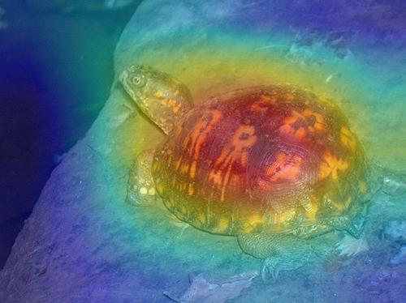

# Overview
The implementation of [Eigen-CAM](https://arxiv.org/abs/2008.00299)

# Example



# Usage
- The example image is generate from mobilenetv2:  
```
python show.py -d cpu -img assets/n01669191_46.JPEG -layer features.18.0
```

- for custom model  
model path is a file including weight and architecture.
```
python show.py -d cpu -img assets/n01669191_46.JPEG -layer {layer name} -m {your model path}
```
- Get predict label  
  My program will print the predict label, you can refer to `show.py`.  
  For imagenet label to class name, you can refer to [class id to name](https://gist.github.com/yrevar/942d3a0ac09ec9e5eb3a).
  
# Note
- Remenber to check whether the image preprocess is the same as yours, if not, you should alert the preprocess in the `show.py` or the result will be wrong.
- If you have cuda, you can just replace the "cpu" to "cuda".
- If you don't specify any layer, my code will use the last layer before global average pooling  to plot heatmap. 
- Generally, the layer is deeper, the interpretaton is better. Accordingly, using the last layer before last global average layer to plot heatmap would be a nice choice.

# All inplementation of CAM method
| Method   | Framework |
| :-----:  | :--------: |
| Grad-CAM | [Pytorch](https://github.com/shyhyawJou/GradCAM-pytorch)/[Tensorflow](https://github.com/shyhyawJou/GradCAM-Tensorflow) | 
| Eigen-CAM | [Pytorch](https://github.com/shyhyawJou/EigenCAM-Pytorch)/[Tensorflow](https://github.com/shyhyawJou/Eigen-CAM-Tensorflow) |
| Ablation-CAM | [Tensorflow](https://github.com/shyhyawJou/Ablation-CAM-Tensorflow) |
| Integrated Gradient | [Pytorch](https://github.com/shyhyawJou/Integrated-Gradient-Pytorch) |
